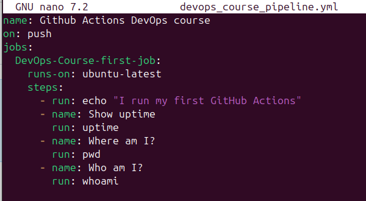

### Фельк Дмитрий Александрович ФИТ-2-2024 НМ

# Практическая работа 6-2.  Добавление функций CI

#### <u>Задание:</u> 

#### Создать репозиторий под новый проект

1. #### В своём профиле на гитлабе создать новый репо

2. #### Склонировать этот репо к себе на vm командой git clone

3. #### Перенести в новый каталог с репо все файлы лабы (плейбуки, роли, и т.д.)

#### Добавить функции CI

1. #### Активировать Actions на стороне github

2. #### Создать и протестировать CI-пайплайны

Создаем новый репозиторий:

Клонируем репозиторий на виртуальную машину и копируем в каталог файлы первой части лабораторной работы:

Активируем CI-пайплайны:

Добавляем CI-пайплайны:

Заполняем  тестовый сценарий:

Добавляем сценарии в гит:

Заполняем боевой сценарий - линтер:

Добавляем в гит:

Проверяем, как отрабатывает сценарий:

